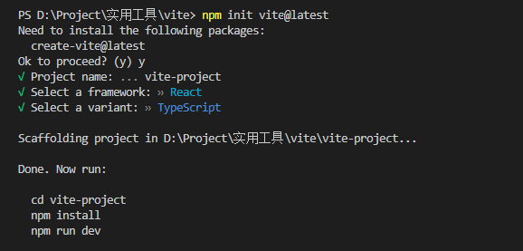
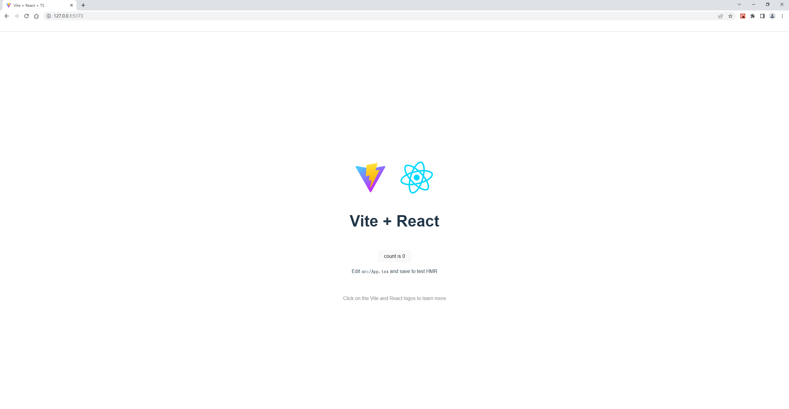
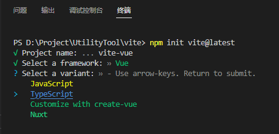
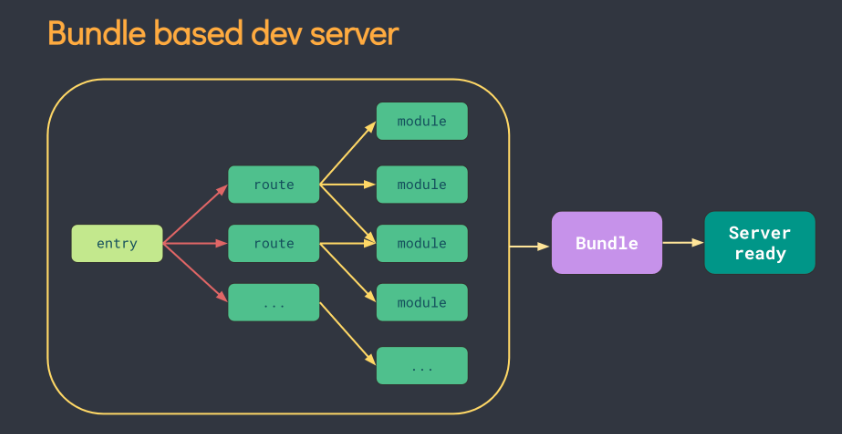
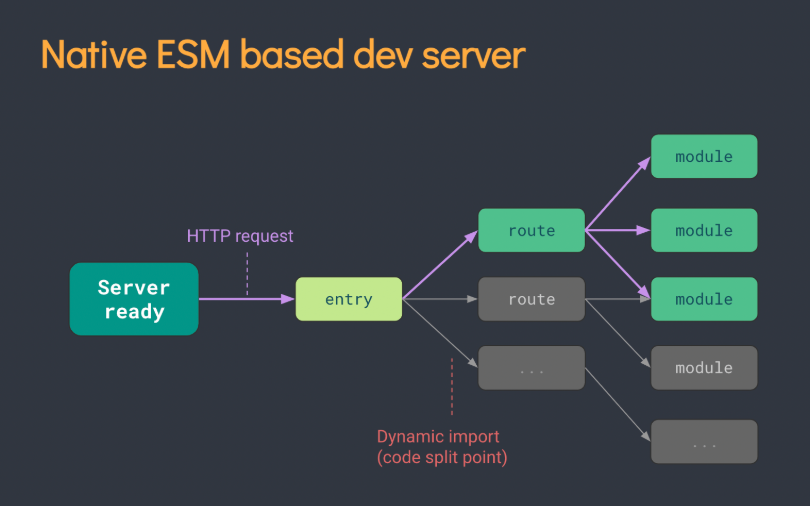
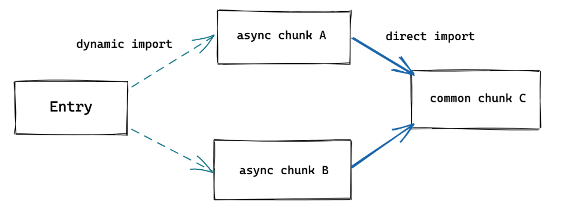
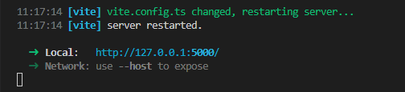
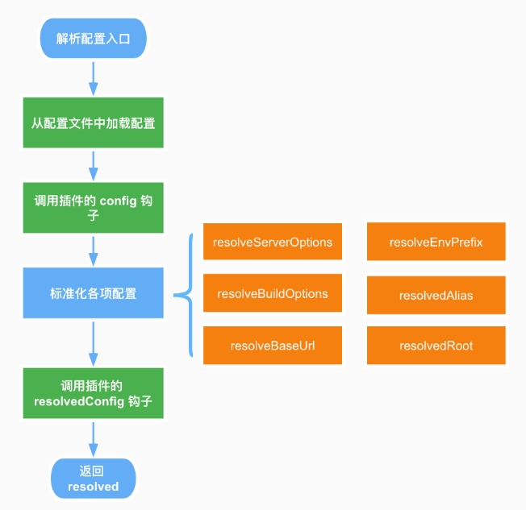
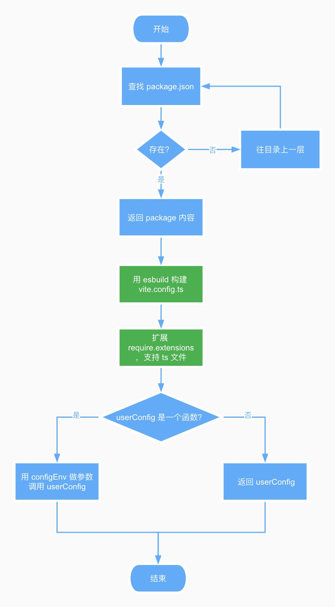

# 开始
它主要由两部分组成：
一个开发服务器，它基于原生ES模块 提供了丰富的内建功能，如速度快到惊人的模块热更新（HMR）。
一套构建指令，它使用 Rollup 打包你的代码，并且它是预配置的，可输出用于生产环境的高度优化过的静态资源。
Vite 仅执行 .ts 文件的转译工作，不执行任何类型检查。
Vite 使用 esbuild 将 TypeScript 转译到 JavaScript，约是 tsc 速度的 20~30 倍，同时 HMR 更新反映到浏览器的时间小于 50ms。

## 使用
## react

安装过程执行下面这行代码，然后通过上下键进行选择。这里选择的是react、ts版本。

```npm init vite@latest```



创建完成项目以后，切到项目文件目录下，安装依赖，然后就可以运行项目了。



## vue



## 目录分析

│  .gitignore							 git的管理配置文件，设置那些目录或文件不管理
│  index.html                           该 Vite 项目的入口文件
│  package-lock.json		  	项目包的锁定文件，用于防止包版本不一样导致的错误
│  package.json				   	项目配置文件，包管理、项目名称、版本和命令
│  tsconfig.json
│  tsconfig.node.json
│  vite.config.ts
│  
├─node_modules					项目依赖包的目录
│              
├─public									项目公用文件
│      vite.svg
│      
└─src										开发文件
    │  App.css
    │  App.tsx
    │  index.css
    │  main.tsx
    │  vite-env.d.ts
    │  
    └─assets							 资源文件
          react.svg


## 多页面应用

比如有多个html文件可以进行启动，可以在vite.config.js文件中进行设置入口点。

# 打包编译原理

## webpack

### 打包机制

`Webpack` 内部的核心机制 - `bundle` 模式引发的。

`Webpack` 能大行其道，归功于它划时代的采用了 `bundle` 机制。通过这种 `bundle` 机制，`Webpack` 可以将项目中各种类型的源文件转化供浏览器识别的 `js`、`css`、`img` 等文件，建立源文件之间的依赖关系，并将数量庞大的源文件合并为少量的几个输出文件。

`bundle` 工作机制的核心部分分为两块：构建模块依赖图 - `module graph` 和将 `module graph` 分解为最终供浏览器使用的几个输出文件。

构建 `module graph` 的过程可以简单归纳为:

1. 获取配置文件中 `entry` 对应的 `url` (这个 `url` 一般为相对路径);
2. `resolve` - 将 `url` 解析为绝对路径，找到源文件在本地磁盘的位置，并构建一个 `module` 对象；
3. `load` - 读取源文件的内容;
4. `transform` - 使用对应的 `loader` 将源文件内容转化为浏览器可识别的类型；
5. `parse` - 将转化后的源文件内容解析为 `AST` 对象，分析 `AST` 对象，找到源文件中的静态依赖(`import xxx from 'xxx'`) 和动态依赖(`import('xx')`)对应的 `url`, 并收集到 `module` 对象中；
6. 遍历第 `5` 步收集到的静态依赖、动态依赖对应的 `url`，重复 `2` - `6` 步骤，直到项目中所有的源文件都遍历完成。

分解 `module graph` 的过程也可以简单归纳为:

1. 预处理 `module graph`，对 `module graph` 做 `tree shaking`；
2. 遍历 `module graph`，根据静态、动态依赖关系，将 `module graph` 分解为 `initial chunk`、`async chunks`；
3. 优化 `initial chunk`、 `async chunks` 中重复的 `module`；
4. 根据 `optimization.splitChunks` 进行优化，分离第三方依赖、被多个 `chunk` 共享的 `module` 到 `common chunks` 中；
5. 根据 `chunk` 类型，获取对应的 `template`；
6. 遍历每个 `chunk` 中收集的 `module`，结合 `template`，为每个 `chunk` 构建最后的输出内容；
7. 将最后的构建内容输出到 `output` 指定位置；

`Webpack` 的这种 `bundle` 机制，奠定了现代静态打包器(如 `Rollup`、`Parcel`、`Esbuild`)的标准工作模式。

然而成也萧何败萧何，强大的 `bundle` 机制，也引发了构建速度缓慢的问题，而且项目规模越大，构建速度越是缓慢。其主要原因是构建 `module graph` 的过程中，涉及到大量的文件 `IO`、文件 `transfrom`、文件 `parse` 操作；以及分解 `module graph` 的过程中，需要遍历 `module graph`、文件 `transform`、文件 `IO` 等。这些操作，往往需要消耗大量的时间，导致构建速度变得缓慢。

开发模式下，`dev server` 需要 `Webpack` 完成整个工作链路才可以启动成功，这就导致构建过程耗时越久，`dev server` 启动越久。

为了加快构建速度，`Webpack` 也做了大量的优化，如 `loader` 的缓存功能、`webpack5` 的持久化缓存等，但这些都治标不治本，只要 `Webpack` 的核心工作机制不变，那 `dev server` 启动优化，依旧是一个任重道远的过程(基本上永远都达不到 `Vite `那样的效果)。

### 热更新

`dev server` 启动以后，会 `watch` 源文件的变化。当源文件发生变化后，`Webpack` 会重新编译打包。这个时候，由于我们只修改了一个文件，因此只需要对这个源文件做 `resolve`、 `load`、 `transfrom`、`parse` 操作，依赖的文件直接使用缓存，因此 `dev server` 的响应速度比冷启动要好很多。

`dev server` 重新编译打包以后，会通过 `ws` 连接通知浏览器去获取新的打包文件，然后对页面做局部更新。


## vite

### 打包机制

`Vite` 之所以在 `dev server` 启动方面，如此给力，是因为它采取了与 `Webpack` 截然不同的 `unbundle` 机制。

`unbundle` 机制，顾名思义，不需要做 `bundle` 操作，即不需要构建、分解 `module graph`，源文件之间的依赖关系完全通过浏览器对 `ESM` 规范的支持来解析。这就使得 `dev server` 在启动过程中只需做一些初始化的工作，剩下的完全由浏览器支持。这和 `Webpack` 的 `bundle` 机制一比，简直就是降维打击，都有点欺负人了 😂。

那有的同学就会问，源文件的 `resolve`、`load`、`transform`、`parse` 什么时候做呢 ？

答案是浏览器发起请求以后，`dev server` 端会通过 `middlewares` 对请求做拦截，然后对源文件做 `resolve`、`load`、`transform`、`parse` 操作，然后再将转换以后的内容发送给浏览器。

这样，通过 `unbundle` 机制， `Vite` 便可以在 `dev server` 启动方面获取远超于 `Webpack` 的优秀体验。

最后再总结一下， `unbundle` 机制的核心:

- 模块之间的依赖关系的解析由浏览器实现；

- 文件的转换由 `dev server` 的 `middlewares` 实现并做缓存；

- 不对源文件做合并捆绑操作；


### 热更新

   由于 `Vite` 采用 `unbundle` 机制，所以 `dev server` 在监听到文件发生变化以后，只需要通过 `ws` 连接通知浏览器去重新加载变化的文件，剩下的工作就交给浏览器去做了。


当冷启动开发服务器时，基于打包器的方式启动必须优先抓取并构建你的整个应用，然后才能提供服务。下图是官方提供的图，很显而易见传统的打包器是遍历所有数据后再进行打包。



官方说将应用中的模块区分为 **依赖** 和 **源码** 两类，使用 esbuild预构建依赖，以 原生 ESM 方式提供源码。实际上是让浏览器接管了打包程序的部分工作：Vite 只需要在浏览器请求源码时进行转换并按需提供源码。根据情景动态导入代码，即只在当前屏幕上实际使用时才会被处理。看下图可以更好地理解，代码按照浏览器的需要进行动态导入编译，这种思想极大提高了编译的效率。



官网在后面怎么更新说的篇幅比较长，可以用一句话进行总结：源码用协商缓存，依赖用强缓存，用http请求更新页面数据。


# 构建优化

## CSS 代码分割

简要的来说就是把要用的CSS样式抽离出来生成一个文件，最后异步操作执行完了再通过link引入这个文件。

如果你更倾向于将所有的 CSS 抽取到一个文件中，你可以通过设置 **build.cssCodeSplit** 为  **false ** 来禁用 CSS 代码分割。

### Chunk 

Chunk 是 Webpack 打包过程中，一堆 Module 的集合。我们知道 Webpack 的打包是从一个入口文件开始，也可以说是入口模块，入口模块引用这其他模块，模块再引用模块。Webpack 通过引用关系逐个打包模块，这些 Module 就形成了一个 Chunk。


## 异步 Chunk 加载优化

在实际项目中，Rollup 通常会生成 “共用” chunk —— 被两个或以上的其他 chunk 共享的 chunk。与动态导入相结合，会很容易出现下面这种场景：



以上场景简单来说就是传统情况下解析完了a才知道需要请求c，vite预加载的时候把代码分割了，请求a和请求c这两件事合成一件事，从而提升了效率。


## 预加载指令生成

https://blog.csdn.net/majing0520/article/details/115352843

讲解非常详细


# vite.config.ts

默认内容

```
import { defineConfig } from 'vite'
import react from '@vitejs/plugin-react'
export default defineConfig({
  plugins: [react()]
})
```

## 默认启动端口

```
  server: {
    port: 5000
  },
```



# 解析配置时Vite 做了这些事

终端中输入子命令后，会通过 cleanOptions 对全局参数做过滤，随后通过 createServer 创建 http 服务器。



对于整个 Vite 应用而言，参数不仅只从命令中获取，也会从上述 configFile 指向的配置文件中加载。配置合并之后，就会去调用插件的 config 钩子，钩子参数就是完整的 config 信息。随后便会对部分配置（上图中橙色部分）做 normalize （规范化），最后执行插件的 resolvedConfig 钩子，整个配置解析过程就结束了。

用一张图描述加载配置的过程：



1. 先在当前和父级目录寻找 package.json 文件，找到后返回文件内容；
2. 例子中配置文件是 vite.config.ts，所以会使用 esbuild 构建输出 CJS 结果；
3. 扩展 require.extensions[.ts]，通过 module._compile 编译加载的 ts 文件；
4. 判断获取到的 config 是不是函数，是的话传入 configEnv 执行函数并获取结果；
5. 最后将第四步结果跟 CLI 的参数进行 merge，得到 config。

了解完整个流程，如果让你去实现一个支持复杂配置的命令行程序，为了提高配置的易用性，就可以模仿 Vite 通过 defineConfig 提供完备的 TypeScript 类型提示，然后使用 esbuild 进行构建，最后扩展 require.extensions 去获取配置。


