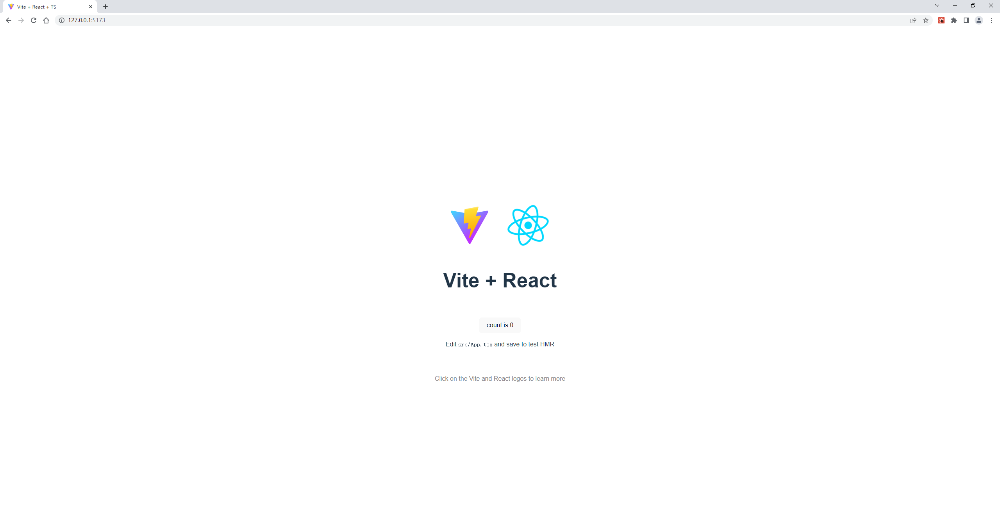

# 前言

vite在去年2月发布了vite2，时隔16个月后在今年7月发布了vite3。它的官网介绍中说是一种新型前端构建工具，能够显著提升前端开发体验，这很难不让大家拿webpack和它进行对比。我们先看看最近半年谷歌对他们的搜索情况（https://trends.google.com/trends/explore?date=2022-03-19%202022-09-19&q=vite,webpack）和vite最近一周npm的下载量：


从图上我们很清晰的可以看到vite的搜索已经超过webpack的搜索热度，周npm下载量高达180万之多。采用率的不断上涨让它迅速形成了庞大的生态系统，毫不夸张的说vite在推动着前端构建工具的发展。本文从构建使用和打包与热更新两方面为大家介绍这款未来的前端构建工具。

# 构建使用

无论是哪款软件，简单易用和友好的官方文档肯定更容易吸引新手玩家的使用，vite也毫不例外。

三大框架中支持react和Vue，支持JavaScript和Typescript，需要Node.js版本 14.18+，可以通过yarn、npm、pnpm引入项目，多种模板预设，vite提供了很多开箱即用的配置，同时它的插件 API 和JavaScript API带来了高度的可扩展性，并有完整的类型支持。全面的配置与高灵活的玩法让人怦然心动，接下来讲一下它的基本使用。这里以react在vite中的使用进行讲解，其他使用方式可以参照https://cn.vitejs.dev/guide/进行自行尝试。

安装过程执行下面这行代码，然后通过上下键进行选择。这里选择的是react、ts版本。

```npm init vite@latest```


创建完成项目以后，切到项目文件目录下，安装依赖，然后就可以运行项目了。




# 打包与热更新

方便大家更好的理解vite在打包与热更新快的原理，本小节将从webpack的打包与热更新入手进行对比。

## webpack打包

下图是来自vite官方文档的一个对比说明图，这幅图片展现了webpack采用bundle 机制打包过程，正如图显示的，当通过入口起点entry开始构建内部的依赖图后，webpack 会找出有哪些模块和库是入口起点（直接和间接）依赖的。根据这些递归构建一个依赖关系图，包含各个module（如图第三步所示），最后将所有这些模块打包成一个或多个 bundle，最后展现到浏览器上。


构建 `module graph` 的过程可以简单归纳为:

1. 获取配置文件中 `entry` 对应的 `url` (这个 `url` 一般为相对路径);
2. `resolve` - 将 `url` 解析为绝对路径，找到源文件在本地磁盘的位置，并构建一个 `module` 对象；
3. `load` - 读取源文件的内容;
4. `transform` - 使用对应的 `loader` 将源文件内容转化为浏览器可识别的类型；
5. `parse` - 将转化后的源文件内容解析为 `AST` 对象，分析 `AST` 对象，找到源文件中的静态依赖(`import xxx from 'xxx'`) 和动态依赖(`import('xx')`)对应的 `url`, 并收集到 `module` 对象中；
6. 遍历第 `5` 步收集到的静态依赖、动态依赖对应的 `url`，重复 `2` - `6` 步骤，直到项目中所有的源文件都遍历完成。

## vite打包

让vite能有远超webpack打包速度的关键在于截然不同的unbundle打包机制。顾名思义，unbundle打包机制就是不进行打包，官方将应用中的模块区分为 **依赖** 和 **源码** 两类，使用 esbuild预构建依赖，以 原生 ESM 方式提供源码。实际上是让浏览器接管了打包程序的部分工作：Vite 只需要在浏览器请求源码时进行转换并按需提供源码。根据情景动态导入代码，即只在当前屏幕上实际使用时才会被处理。通过浏览器对ESM规范的支持解析源文件之间的依赖关系，启动时只需要做初始化，后面由浏览器支持，这种方式极大地提升了打包效率。

总结一下， unbundle 机制的核心:

- 模块之间的依赖关系的解析由浏览器实现；

- 文件的转换由 dev server 的 middlewares 实现并做缓存；

- 不对源文件做合并捆绑操作；


## webpack热更新

webpack官网从多个角度来解释HMR 的工作原理。总结一下是通过这几种方式加快速度： 

+ 保留在完全重新加载页面时丢失的应用程序状态。 

+ 只更新变更内容，以节省宝贵的开发时间。 

+ 调整样式更加快速 - 几乎相当于在浏览器调试器中更改样式。

这里我们就详细看看HMR Runtime的关键方法 check 和 apply。check发送请求判断manifest是否需要更新，请求成功，待更新 chunk 会和当前加载过的 chunk 进行比较。对每个加载过的 chunk，会下载相对应的待更新 chunk。当所有待更新 chunk 完成下载，就会准备切换到 ready 状态。apply 方法将所有被更新模块标记为无效。对于每个无效模块，都需要在模块中有一个更新处理函数(update handler)，或者在它的父级模块们中有更新处理函数。否则，无效标记冒泡，并也使父级无效。每个冒泡继续，直到到达应用程序入口起点，或者到达带有更新处理函数的模块（以最先到达为准，冒泡停止）。如果它从入口起点开始冒泡，则此过程失败。  之后，所有无效模块都被（通过 dispose 处理函数）处理和解除加载。然后更新当前 hash，并且调用所有 "accept" 处理函数。runtime 切换回闲置状态，一切照常继续。

## vite热更新

在 Vite 中，HMR 是在原生 ESM 上执行的。具体执行步骤是这样的：

+ 编辑文件后，vite使被编辑的模块与最近的 HMR 边界之间链失活；
+ Vite 同时利用 HTTP 头来加速整个页面的重新加载；
+ 源码模块的请求会根据 304 Not Modified 进行协商缓存，而依赖模块请求则会通过 Cache-Control: max-age=31536000,immutable 进行强缓存，最后完成页面更新。

vite在热更新方面比webpack更快的原因就在于vite让浏览器为我们做更多的事情，而webpack更新完了还需要将无效模块卸载后用accept进行更新。

# 结语

vite的构建使用和打包与热更新就介绍到这里，如果对vite感兴趣的伙伴可以看看官网的介绍。这里提供一些参考网址希望可以帮助到大家：

vite官网地址：https://cn.vitejs.dev/

vite配置：https://cn.vitejs.dev/config/

vite的github地址：https://github.com/vitejs/vite

webpack官网地址：https://www.webpackjs.com/


