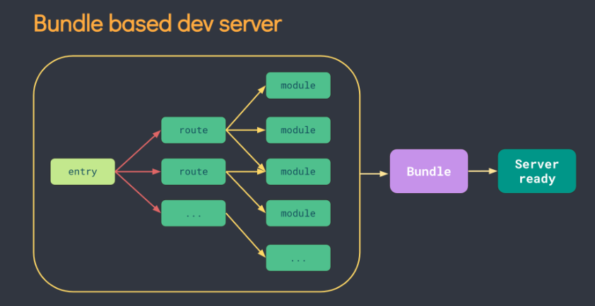
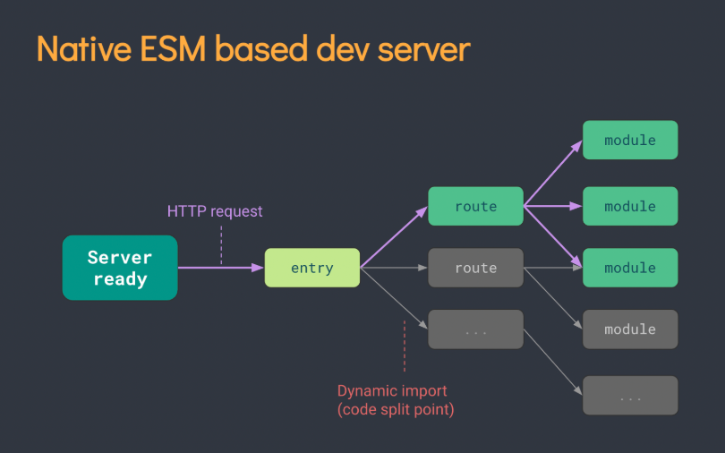
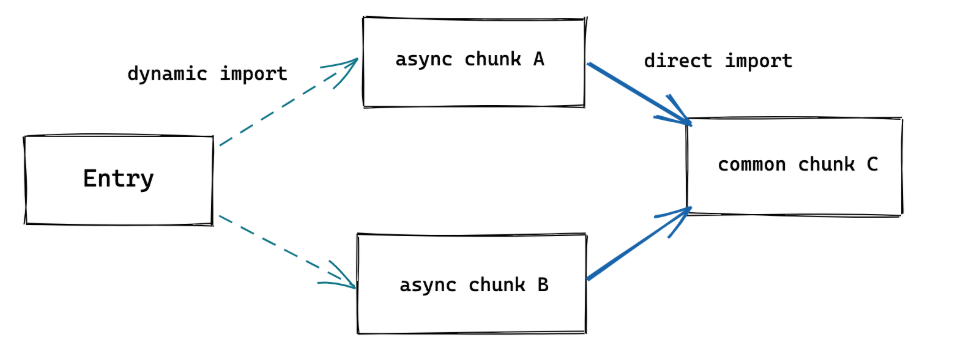

# 开始
它主要由两部分组成：
一个开发服务器，它基于原生ES模块 提供了丰富的内建功能，如速度快到惊人的模块热更新（HMR）。
一套构建指令，它使用 Rollup 打包你的代码，并且它是预配置的，可输出用于生产环境的高度优化过的静态资源。
Vite 仅执行 .ts 文件的转译工作，不执行任何类型检查。
Vite 使用 esbuild 将 TypeScript 转译到 JavaScript，约是 tsc 速度的 20~30 倍，同时 HMR 更新反映到浏览器的时间小于 50ms。

## 打包编译原理

当冷启动开发服务器时，基于打包器的方式启动必须优先抓取并构建你的整个应用，然后才能提供服务。下图是官方提供的图，很显而易见传统的打包器是遍历所有数据后再进行打包。



官方说将应用中的模块区分为 **依赖** 和 **源码** 两类，使用 esbuild预构建依赖，以 原生 ESM 方式提供源码。实际上是让浏览器接管了打包程序的部分工作：Vite 只需要在浏览器请求源码时进行转换并按需提供源码。根据情景动态导入代码，即只在当前屏幕上实际使用时才会被处理。看下图可以更好地理解，代码按照浏览器的需要进行动态导入编译，这种思想极大提高了编译的效率。



官网在后面怎么更新说的篇幅比较长，可以用一句话进行总结：源码用协商缓存，依赖用强缓存，用http请求更新页面数据。


## 特点


## 使用
安装过程执行下面这行代码，然后通过上下键进行选择。这里选择的是react、ts版本。

```npm init vite@latest```


创建完成项目以后，切到项目文件目录下，安装依赖，然后就可以运行项目了。


## 目录分析

│  .gitignore							 git的管理配置文件，设置那些目录或文件不管理
│  index.html                           该 Vite 项目的入口文件
│  package-lock.json		  	项目包的锁定文件，用于防止包版本不一样导致的错误
│  package.json				   	项目配置文件，包管理、项目名称、版本和命令
│  tsconfig.json
│  tsconfig.node.json
│  vite.config.ts
│  
├─node_modules					项目依赖包的目录
│              
├─public									项目公用文件
│      vite.svg
│      
└─src										开发文件
    │  App.css
    │  App.tsx
    │  index.css
    │  main.tsx
    │  vite-env.d.ts
    │  
    └─assets							 资源文件
          react.svg


## 多页面应用

比如有多个html文件可以进行启动，可以在vite.config.js文件中进行设置入口点。


# 构建优化

## CSS 代码分割

简要的来说就是把要用的CSS样式抽离出来生成一个文件，最后异步操作执行完了再通过link引入这个文件。

如果你更倾向于将所有的 CSS 抽取到一个文件中，你可以通过设置 **build.cssCodeSplit** 为  **false ** 来禁用 CSS 代码分割。

### Chunk 

Chunk 是 Webpack 打包过程中，一堆 Module 的集合。我们知道 Webpack 的打包是从一个入口文件开始，也可以说是入口模块，入口模块引用这其他模块，模块再引用模块。Webpack 通过引用关系逐个打包模块，这些 Module 就形成了一个 Chunk。


## 异步 Chunk 加载优化

在实际项目中，Rollup 通常会生成 “共用” chunk —— 被两个或以上的其他 chunk 共享的 chunk。与动态导入相结合，会很容易出现下面这种场景：



以上场景简单来说就是传统情况下解析完了a才知道需要请求c，vite预加载的时候把代码分割了，请求a和请求c这两件事合成一件事，从而提升了效率。


## 预加载指令生成

https://blog.csdn.net/majing0520/article/details/115352843

讲解非常详细


