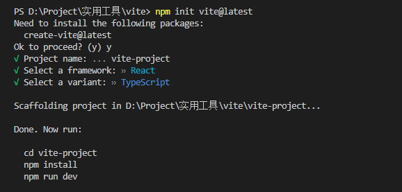

# 开始
它主要由两部分组成：
一个开发服务器，它基于原生ES模块 提供了丰富的内建功能，如速度快到惊人的模块热更新（HMR）。
一套构建指令，它使用 Rollup 打包你的代码，并且它是预配置的，可输出用于生产环境的高度优化过的静态资源。
Vite 仅执行 .ts 文件的转译工作，并 执行任何类型检查。
Vite 使用 esbuild 将 TypeScript 转译到 JavaScript，约是 tsc 速度的 20~30 倍，同时 HMR 更新反映到浏览器的时间小于 50ms。

## 使用
安装过程执行下面这行代码，然后通过上下键进行选择。这里选择的是react、ts版本。

```npm init vite@latest```




